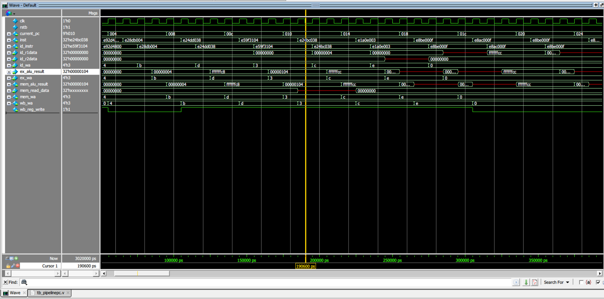
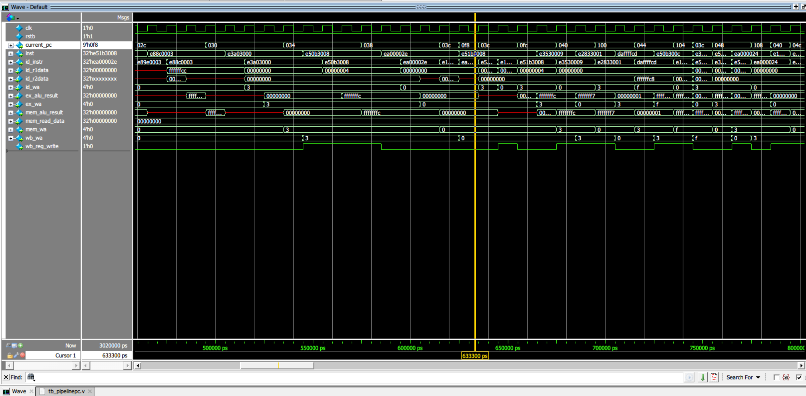
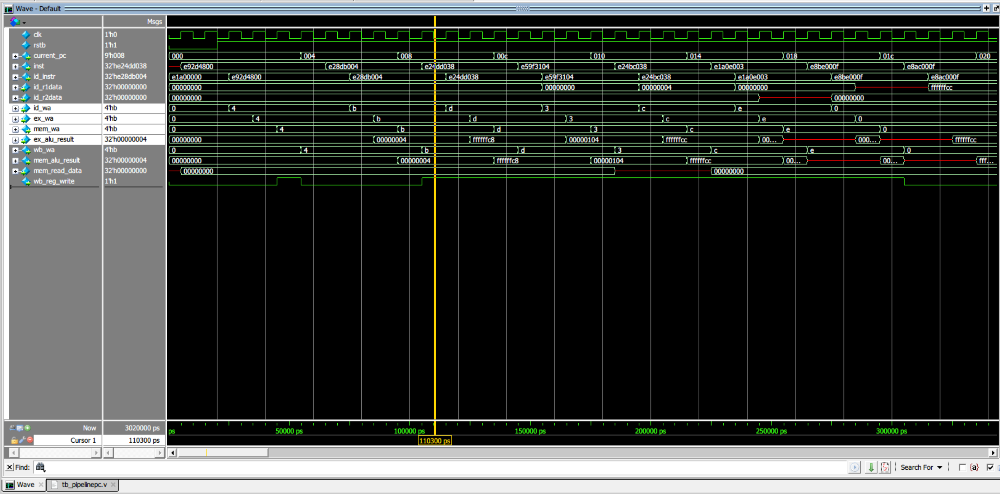

# Quad HW-Threaded ARM ISA-Compatible Processor on NetFPGA

## 📌 Project Overview
This project features a **5-stage pipelined ARM ISA-compatible processor** implemented in Verilog and deployed on the NetFPGA platform. A key architectural highlight is the integration of **hardware support for four simultaneous hardware threads (SMT)**, enabling zero-overhead context switching.

The processor executes a robust subset of the **ARMv4T (ARM7TDMI)** instruction set, capable of running compiler-generated C programs, including complex benchmarks like bubble sort.

### Key Objectives
* **Hardware/Software Co-design:** Translating C algorithms into ARM assembly via the `arm-none-eabi` toolchain.
* **Architectural Design:** Developing a custom 5-stage datapath and control unit with hazard handling.
* **Concurrency:** Implementing a round-robin hardware scheduler for 4-thread interleaving.
* **Hardware Verification:** Validating execution flow and memory integrity on NetFPGA silicon.

---

## 🏗️ Processor Architecture
The core utilizes a classic RISC pipeline structure:

1.  **IF (Instruction Fetch):** Fetches 32-bit instructions from IMEM based on the current Thread ID.
2.  **ID (Instruction Decode):** Decodes opcode and manages the banked Register File (4 contexts).
3.  **EX (Execute):** Performs ALU operations, address calculations, and branch target evaluation.
4.  **MEM (Memory Access):** Handles Load/Store operations to Data Memory.
5.  **WB (Write Back):** Updates the architectural state in the register file.

### Hardware Multithreading Extension
To maximize throughput and hide latencies, the design incorporates:
* **Quad-Banked Register Files:** Four independent contexts (RF0–RF3).
* **Thread-Specific PCs:** Four independent Program Counters.
* **Zero-Overhead Switching:** Thread selection logic allows the processor to switch contexts every clock cycle without the software-level "save/restore" penalty.

---

## 📜 ARM Instruction Encoding (A32)
All instructions are fixed-width 32-bit (ARM Mode).

### 1. Instruction Fields
| Bits | Field | Description |
|:---:|:---:|:---|
| **31–28** | `cond` | Execution condition (e.g., `1110` for AL - Always) |
| **27–0** | `instr` | Instruction-specific payload |

### 2. Data Processing Format
Used for: `ADD`, `SUB`, `MOV`, `CMP`, `LSL`
* **I (Bit 25):** Immediate flag.
* **Opcode (24–21):** Defines the operation.
* **Rn (19–16):** First source operand register.
* **Rd (15–12):** Destination register.
* **Operand2 (11–0):** Flexible second operand (Immediate or Shifted Register).

### 3. Load/Store & Branch
* **Memory:** Supports `LDR`/`STR` (Single) and `LDM`/`STM` (Multiple/Stack).
* **Branch:** Target calculated as: $Target = PC + (SignExtend(offset) \ll 2)$.

---

## 🛠️ Supported ISA Subset
| Category | Instructions |
|:---|:---|
| **Data Processing** | `ADD`, `SUB`, `MOV`, `CMP`, `LSL` |
| **Memory/Stack** | `LDR`, `STR`, `LDM` (POP), `STM` (PUSH) |
| **Flow Control** | `B`, `BGE`, `BLE`, `BX` |

---

## 💻 Software Workflow & Verification
1.  **Compilation:** C source code is compiled using the `arm-none-eabi-gcc` toolchain.
2.  **Assembling:** Assembly code is converted to hex-encoded machine code.
3.  **Simulation:** Verified via Verilog testbenches (ModelSim/Vivado).
4.  **Hardware Deployment:** Binary images loaded into NetFPGA BRAM.
5.  **Validation:** Comparison of memory dumps (pre- vs. post-sort) and simultaneous execution of four independent threads.

---

## ⚙️ Technologies Used
* **Languages:** Verilog HDL, C, Assembly
* **Tools:** ARM GNU Toolchain, Vivado/ISE, ModelSim
* **Platform:** NetFPGA (Xilinx Virtex-based)

---

## 📊 Results & Verification
The processor design was rigorously tested and validated using cycle-accurate RTL simulations in ModelSim prior to FPGA deployment. Key achievements include:

### 1. Pipeline Hazard Resolution (Data Forwarding & Flush)
Successfully implemented and verified a full Forwarding Unit to seamlessly handle Read-After-Write (RAW) data hazards. 

  
  
<i>Figure 1: Forwarding Unit injecting memory read data directly into the ALU operand to resolve RAW hazards without stalling.</i>

Alongside data hazards, a robust hardware Pipeline Flush mechanism was introduced to prevent phantom instruction execution during branch operations (Control Hazards).

  
  
<i>Figure 2: Pipeline Flush mechanism correctly zeroing out the Write-Back enable signal (`wb_reg_write`) after a Branch is taken.</i>

### 2. Datapath Integrity
Cycle-by-cycle waveform verification confirmed perfect instruction propagation across all 5 stages (IF, ID, EX, MEM, WB).

  
  
<i>Figure 3: Clean staircase instruction propagation through the 5-stage pipeline.</i>

### 3. Zero-Overhead Multithreading & Algorithm Execution
* **Multithreading:** Verified the 4-way round-robin hardware scheduler. Waveform analysis confirms the independent execution of four threads—each utilizing its dedicated Register File bank and Program Counter—with zero clock cycle penalty for context switching.
* **Algorithm Execution:** Successfully executed compiler-generated ARM assembly for complex algorithms (e.g., Bubble Sort). Validated memory state dumps confirm 100% accuracy in Load/Store operations and branching logic.
